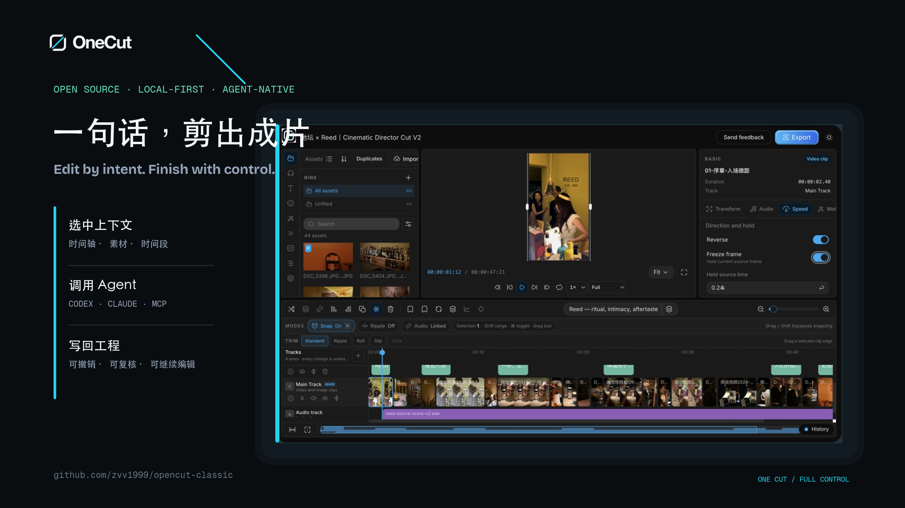
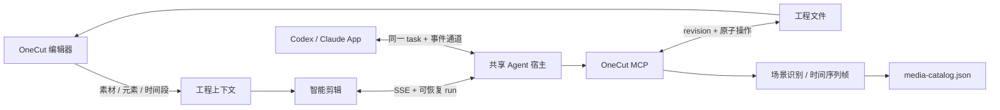

<div align="center">
  
  <h3>一句话，剪出成片。</h3>
  <p><strong>Edit by intent. Finish with control.</strong></p>
  <p>本地优先、Agent 原生、可人工精修的开源视频编辑器。</p>
</div>



## OneCut 是什么

OneCut 把专业时间轴与 Codex、Claude 等 Agent 连接在一起。用户可以在浏览器中选中素材、
元素或时间段，用自然语言生成剪辑计划并把修改精确写回工程；也可以从 Agent App 通过
MCP 读取和控制同一个项目。

它不是“一键生成后无法修改”的视频工具。工程文件、时间轴、素材、关键帧、字幕、调色、
音频和导出设置始终可见、可撤销、可人工继续编辑。

> OneCut is an independent fork of
> [OpenCut Classic](https://github.com/opencut-app/opencut-classic). It uses an
> original name and visual identity and is not affiliated with or endorsed by
> the OpenCut project. See [NOTICE.md](NOTICE.md) for attribution.

## 核心能力

- **专业剪辑工作台**：素材库、多轨时间轴、预览、关键帧、变速、调色、字幕、音频、
  导出队列与工程历史。
- **Agent 智能剪辑**：通过对话读取工程、拆分片段、重排时间轴、修改属性、处理字幕、
  理解素材和执行画面质检。
- **精确上下文引用**：把时间轴选区、播放头范围、素材库元素或轨道片段一键加入对话。
- **浏览器与 App 双向续聊**：浏览器和 Codex App 连接同一个 app-server、原生 task 与
  事件通道。
- **开放 MCP 原子能力**：Agent 可进行工程读写、场景检测、时间序列取帧、实时标签页
  操作、渲染验证和 revision 冲突保护。
- **本地素材与高画质输出**：预览可使用高质量代理，最终导出始终读取原片。

## 工作方式



工程文件是唯一事实来源。Agent 每轮先读取最新 revision，再通过 MCP 落盘；浏览器与
Agent App 只是同一任务的不同入口，不维护两份独立会话。

## 快速开始

### 环境要求

- [Bun](https://bun.sh/) 1.3.14+
- [FFmpeg](https://ffmpeg.org/) 与 FFprobe
- 推荐：已经登录的 Codex / ChatGPT 桌面 App、Codex CLI 或 Claude Code
- 可选：Docker 与 Docker Compose（数据库、Redis 和完整自托管模式）

### 一条命令启动

```bash
git clone https://github.com/zvv1999/opencut-classic.git onecut
cd onecut
git switch feat/agent-drivable
bun run setup:local
```

该命令会创建本地工程目录、安装依赖、启动编辑器、执行环境诊断，并打开
[http://127.0.0.1:3000](http://127.0.0.1:3000)。重复运行会复用已有配置和进程；只体验
编辑器不需要 Docker。

检查当前环境：

```bash
bun run agent:doctor
```

### 两种使用方式

1. **在 OneCut 中使用 Agent**：进入工程后打开“智能剪辑”，复用本机已有的 Codex
   登录，无需再次填写账号或 API Key。
2. **在 Agent App 中控制 OneCut**：在设置页为 Codex 或 Claude 安装 OneCut MCP，
   然后直接从 App 读取和修改当前工程。

需要数据库、Redis 和服务端 Provider 时再运行：

```bash
BETTER_AUTH_SECRET="$(openssl rand -hex 32)" docker compose up -d
```

Docker 模式不会读取宿主机 Codex/Claude 登录；服务端智能剪辑需要单独配置 API
Provider。本机账号复用和 App MCP 推荐使用本地模式。

## 浏览器与 Codex App 共用会话

OneCut 默认在 `ws://127.0.0.1:48721` 按需启动共享 app-server。首次使用或从旧宿主迁移：

1. 正常退出 Codex / ChatGPT 桌面 App。
2. 在仓库根目录运行 `bun run codex:shared-app`。
3. 从 OneCut 智能剪辑发送一条消息。
4. Codex App 会出现以工程名命名的同一任务，之后可从任一端继续。

不要同时启动第二个私有 app-server。自定义端口时，浏览器和桌面 App 必须使用同一个
WebSocket 地址。

## 推荐剪辑链路

1. 导入素材并建立基础轨道。
2. 在时间轴或素材库选择需要 Agent 理解的对象。
3. 点击“添加引用”，确认上下文后描述目标。
4. 简单确定性修改用“快速”，日常编辑用“均衡”，镜头判断和最终验收用“导演”。
5. 观察流式回复、工具调用与工程修改。
6. 在编辑器里播放和微调；下一轮会读取人工修改后的 revision。
7. 需要完整工作区能力时，在 Codex App 打开同名任务继续。

示例：

```text
把我选中的 21.3–29.0 秒压到 5 秒左右，保留人物动作起点和落点，不要改其他片段。

分析这三个素材的场景变化，为 30 秒竖屏短片挑选可用区间，先给方案再落工程。

保留我刚才手动调整的切点，把后半段节奏再收紧，并在落点前加 4 帧缓冲。
```

## 性能档位

| 档位         | 推理强度 | 画面识别 | 回写验证 | 适用场景                             |
| ------------ | -------- | -------- | -------- | ------------------------------------ |
| 快速         | `low`    | 关闭     | 关闭     | 文案、重命名、确定性修改             |
| 均衡（默认） | `medium` | 关闭     | 基础     | 日常剪辑与 revision 确认             |
| 导演         | `xhigh`  | 自动     | 完整     | 镜头判断、节奏重排、多模态与画面质检 |

## 配置

常用环境变量位于 `apps/web/.env.example`：

```bash
# 默认自动发现；仅自定义安装位置时填写
# CODEX_BIN=/absolute/path/to/codex
# CLAUDE_BIN=/absolute/path/to/claude

OPENCUT_CODEX_APP_SERVER_URL=ws://127.0.0.1:48721
OPENCUT_CODEX_WORKSPACE_ROOT=/absolute/path/to/chatcut
OPENCUT_PROJECTS_DIR=/absolute/path/to/opencut-projects
OPENCUT_CODEX_DESKTOP_SYNC=0
```

`OPENCUT_*`、`opencut://` 和 `.opencut` 是为兼容上游工程、现有会话与协议保留的稳定
标识，不是公开品牌。新版本会在兼容旧数据的前提下逐步提供 `ONECUT_*` 别名。

项目级 `.codex/config.toml` 目前仍以兼容名 `opencut` 注册 MCP。不要改用缺少原生
`fetch` 的旧 Node，也不要为智能剪辑注册 LocalCut。

## 仓库结构

```text
apps/web/       Next.js 编辑器、智能剪辑 UI、API 与共享 app-server 客户端
apps/mcp/       OneCut MCP：工程文件、媒体分析和实时编辑器原子能力
apps/desktop/   GPUI 原生桌面壳（开发中）
rust/           GPU 合成、效果、遮罩和 WASM 核心
docs/brand/     Logo、视觉规范与宣传物料
docs/           架构、路线图、验收报告与 Agent 工作规范
```

进一步阅读：

- [智能剪辑双向工作流与 Agent 操作规范](docs/agent-smart-edit.md)
- [品牌资产与使用规范](docs/brand/README.md)
- [编辑器目标计划](docs/roadmap/opencut-editor-goal-plan.md)
- [编解码与画质目标计划](docs/roadmap/opencut-codec-goal-plan.md)
- [编辑器功能与截图报告](docs/reports/opencut-editor-goal/index.html)
- [编解码、播放与导出报告](docs/reports/opencut-codec-goal/index.html)

## 开发与验证

```bash
bun install
bun test
node --test apps/mcp/src/__tests__/*.test.mjs
bun run typecheck:web
bun run lint:web
bun run build:web
bun audit
```

提交前至少运行受影响模块测试、类型检查、ESLint、生产构建和依赖审计。请勿提交真实
素材、API Key、个人路径、项目缓存或本地 Agent 会话。

## 贡献

Issue、文档、测试、性能优化和可复现的 Bug 修复都欢迎。开始大功能前请先阅读
[贡献指南](.github/CONTRIBUTING.md) 并开 Issue 对齐设计边界。

## 上游、商标与许可证

OneCut 延续 OpenCut Classic 的本地优先方向，并在 Agent 协作、时间轴、媒体理解和专业
编辑体验上持续迭代。代码采用 [MIT License](LICENSE)。原项目归属与第三方声明见
[NOTICE.md](NOTICE.md)。

OneCut 名称与本仓库的 Logo 是独立设计，不使用 OpenCut 官方 Logo。公开发布前仍应完成
目标国家/地区的商标与域名核查；代码许可证不等同于商标许可。
