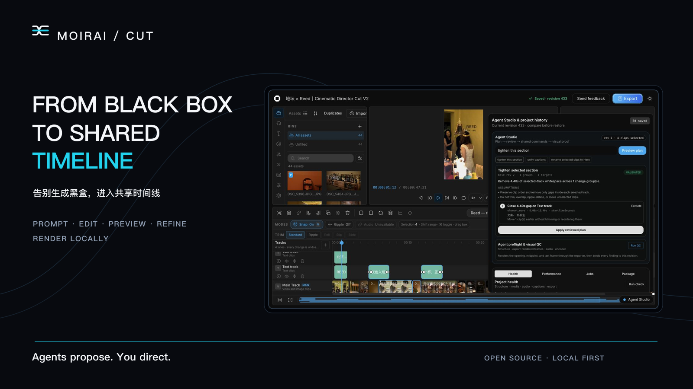
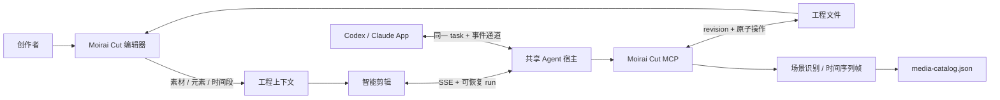

<div align="center">
  
  <h3>告别生成黑盒，进入共享时间线。</h3>
  <p><strong>FROM BLACK BOX TO SHARED TIMELINE</strong></p>
  <p>对话生成，直接修改，实时预览，本地成片。</p>
  <p><strong>Prompt. Edit. Preview. Refine. Render locally.</strong></p>
</div>



> **v0.1.1 Public Preview** — Moirai Cut is ready for local editing and
> Agent-driven workflows. The project format and integration surface may still
> evolve before 1.0, with migration notes published in the changelog.

## Moirai Cut 是什么

Moirai Cut 是一个**开源、本地优先的人机协同视频编辑器**。人与 Agent 在同一条可见
时间线上，通过对话、直接操作与实时预览，共同完成从生成到成片的全过程。你可以在
浏览器里选择素材、元素或时间段，用自然语言让 Codex、Claude 等 Agent 理解、规划和
修改；也可以在 Agent App 中通过 MCP 读取和控制当前工程。

它不是“一键生成后无法继续修改”的黑盒。素材、时间轴、字幕、关键帧、调色、音频和
导出设置始终可见、可撤销、可人工精修。工程文件是唯一事实来源，人与 Agent 的每次
修改都回到同一条时间线。

> **Moirai Cut is an open-source, local-first video editor where humans and
> agents create inside the same visible, editable loop.**

> Moirai Cut is an independent fork of
> [OpenCut Classic](https://github.com/opencut-app/opencut-classic). It uses an
> original name and visual identity and is not affiliated with or endorsed by
> the OpenCut project. See [NOTICE.md](NOTICE.md) for attribution.

## 为什么是 Moirai Cut

Moirai 在这里不是“替你决定成片”的命运黑盒，而是一台人与 Agent 共用的织机：Agent
提出素材组织和修改方案，人掌握叙事方向；双方在同一条可见时间线上反复编织、查看和
调整，直到作品完成。

**Agents propose. You direct.** Agent 参与剪辑，最终控制始终在你。

- **对话** — 快速表达复杂意图并引用准确工程上下文。
- **直接操作** — 精确处理拖动、裁切、节奏、关键帧与参数。
- **实时预览** — 随时确认接近最终成片的画面与声音。
- **共享工程状态** — Agent 的每一步都可见、可编辑、可撤销，不会生成新的黑盒副本。

## 核心能力

- **专业剪辑工作台**：素材库、多轨时间轴、预览、关键帧、变速、调色、字幕、音频、
  导出队列与工程历史。
- **Agent 智能剪辑**：对话读取工程、拆分片段、重排时间轴、修改属性、处理字幕、理解
  素材和执行画面质检。
- **精确上下文引用**：把时间轴选区、播放头范围、素材库元素或轨道片段一键加入对话。
- **浏览器与 Agent App 双向续聊**：浏览器和 Codex App 连接同一个 app-server、原生
  task 与事件通道。
- **开放 MCP 原子能力**：Agent 可进行工程读写、场景检测、时间序列取帧、实时标签页
  操作、渲染验证和 revision 冲突保护。
- **本地素材与高画质输出**：预览可使用代理文件，最终导出始终读取原片。

## 工作方式



浏览器与 Agent App 是同一任务的两个入口，不各自维护一份工程或伪造同步消息。Agent
每轮先读取最新 revision，再通过 MCP 回写并验证结果。

## 快速开始

### 环境要求

- [Bun](https://bun.sh/) 1.3.14+
- [FFmpeg](https://ffmpeg.org/) 与 FFprobe
- 推荐：已经登录的 Codex / ChatGPT 桌面 App、Codex CLI 或 Claude Code
- 可选：Docker 与 Docker Compose（数据库、Redis 和完整自托管模式）

### 本地启动

```bash
git clone https://github.com/zvv1999/moirai-cut.git
cd moirai-cut
bun run setup:local
```

该命令会安装依赖、创建本地工程目录、启动编辑器、执行环境诊断，并打开
[http://127.0.0.1:3000](http://127.0.0.1:3000)。重复运行会复用已有配置和进程；只体验
编辑器不需要 Docker。

检查当前环境：

```bash
bun run agent:doctor
```

### 两种 Agent 使用方式

1. **在 Moirai Cut 中使用 Agent**：进入工程后打开“智能剪辑”，复用本机已有的 Codex 或
   Claude 登录；没有本地环境时可按设置向导配置 Provider。
2. **在 Agent App 中控制 Moirai Cut**：在设置页为 Codex 或 Claude 安装 Moirai Cut MCP，
   然后从 App 读取、分析和修改当前工程。

### 一次调用完成可编辑首剪

打开左侧“智能剪辑”后，点击 **开始完整创作**。界面会调用项目内置的
`moirai-cut-create` Skill，依次完成素材与声音理解、共享时间线编排、结构与代表帧质检，
并导出本地 draft 审阅文件。Agent 的修改直接落在当前工程，仍可拖动、裁切、撤销和继续
对话；不是另外生成一份不可编辑的黑盒视频。

也可以在 Codex / Claude 中直接说：

```text
使用 $moirai-cut-create，把当前素材完成一版 45 秒左右的可编辑首剪，保留现场声并导出审阅版。
```

Skill 源码与评测位于 [`.agents/skills/moirai-cut-create`](.agents/skills/moirai-cut-create/)。

需要数据库、Redis 和服务端 Provider 时再运行：

```bash
BETTER_AUTH_SECRET="$(openssl rand -hex 32)" docker compose up -d
```

Docker 模式不会读取宿主机 Codex/Claude 登录。服务端智能剪辑需要单独配置 API
Provider；本机账号复用和 App MCP 推荐使用本地模式。

## 浏览器与 Codex App 共用会话

Moirai Cut 默认在 `ws://127.0.0.1:48721` 按需启动共享 app-server。首次使用或从旧宿主
迁移：

1. 正常退出 Codex / ChatGPT 桌面 App。
2. 在仓库根目录运行 `bun run codex:shared-app`。
3. 从 Moirai Cut 智能剪辑发送一条消息。
4. Codex App 会出现以工程名命名的同一任务，之后可从任一端继续。

不要同时启动第二个私有 app-server。自定义端口时，浏览器和桌面 App 必须使用同一个
WebSocket 地址。

## 推荐剪辑链路

1. 导入素材并建立基础轨道。
2. 在时间轴或素材库选择需要 Agent 理解的对象。
3. 点击“添加引用”，确认上下文后描述目标。
4. 简单确定性修改用“快速”，日常编辑用“均衡”，镜头判断和最终验收用“导演”。
5. 观察流式回复、工具调用和工程修改。
6. 在编辑器里播放和微调；下一轮会读取人工修改后的 revision。
7. 需要完整工作区能力时，在 Agent App 打开同名任务继续。

```text
把我选中的 21.3–29.0 秒压到 5 秒左右，保留人物动作起点和落点，不要改其他片段。

分析这三个素材的场景变化，为 30 秒竖屏短片挑选可用区间，先给方案再落工程。

保留我刚才手动调整的切点，把后半段节奏再收紧，并在落点前加 4 帧缓冲。
```

## 性能档位

| 档位         | 推理强度 | 画面识别 | 回写验证 | 适用场景                         |
| ------------ | -------- | -------- | -------- | -------------------------------- |
| 快速         | `low`    | 关闭     | 关闭     | 文案、重命名、确定性修改         |
| 均衡（默认） | `medium` | 关闭     | 基础     | 日常剪辑与 revision 确认         |
| 导演         | `xhigh`  | 自动     | 完整     | 镜头判断、节奏重排、多模态与质检 |

## 配置与兼容层

常用环境变量位于 [`apps/web/.env.example`](apps/web/.env.example)：

```bash
# 默认自动发现；仅自定义安装位置时填写
# CODEX_BIN=/absolute/path/to/codex
# CLAUDE_BIN=/absolute/path/to/claude

OPENCUT_CODEX_APP_SERVER_URL=ws://127.0.0.1:48721
OPENCUT_CODEX_WORKSPACE_ROOT=/absolute/path/to/chatcut
OPENCUT_PROJECTS_DIR=/absolute/path/to/opencut-projects
OPENCUT_CODEX_DESKTOP_SYNC=0
```

`OPENCUT_*`、`opencut://`、`.opencut`、`opencut-wasm` 和 MCP 注册名 `opencut` 是为
兼容上游工程、现有会话与协议保留的稳定标识，不是公开品牌。不要在没有迁移方案和向后
兼容测试的情况下重命名它们。新安装可使用 `MOIRAI_PROJECTS_DIR`，启动脚本仍会读取
过渡期的 `HOLOCUT_PROJECTS_DIR`、`ONECUT_PROJECTS_DIR` 与 `OpenCutProjects` 目录
以便迁移。

## 仓库结构

```text
apps/web/       Next.js 编辑器、智能剪辑 UI、API 与共享 app-server 客户端
apps/mcp/       Moirai Cut MCP：工程文件、媒体分析和实时编辑器原子能力
apps/desktop/   GPUI 原生桌面壳（开发中）
rust/           GPU 合成、效果、遮罩和 WASM 核心
docs/brand/     Logo、视觉规范与宣传物料
docs/           使用、架构、隐私与 Agent 工作规范
```

进一步阅读：

- [智能剪辑双向工作流与 Agent 操作规范](docs/agent-smart-edit.md)
- [品牌资产与使用规范](docs/brand/README.md)
- [隐私与网络出站说明](docs/PRIVACY_AND_NETWORK.md)
- [系统要求、编解码与硬件限制](docs/SYSTEM_REQUIREMENTS.md)
- [治理规则](GOVERNANCE.md) 与 [发布手册](RELEASING.md)
- [版本变更与兼容迁移](CHANGELOG.md)

公开路线图和待办通过 [GitHub Issues](https://github.com/zvv1999/moirai-cut/issues)
维护。一次性验收报告、真实工程截图、SBOM 和依赖审计结果不进入源码树；可复现检查保留
在 GitHub Actions，发布证据随对应的 GitHub Release 提供。

## 开发与验证

```bash
bun install --frozen-lockfile
bun test
bun run test:mcp
bun run typecheck:web
bun run lint:web
NODE_ENV=production bun run build:web
bun audit
bun run release:check
```

提交前至少运行受影响模块测试、类型检查、ESLint、生产构建和依赖审计。请勿提交真实
素材、API Key、个人路径、项目缓存或本地 Agent 会话。

## 贡献与安全

Issue、文档、测试、性能优化和可复现的 Bug 修复都欢迎。开始大功能前请阅读
[贡献指南](.github/CONTRIBUTING.md) 并开 Issue 对齐设计边界。安全问题请按
[安全策略](.github/SECURITY.md) 私下报告；品牌使用边界见 [TRADEMARKS.md](TRADEMARKS.md)。

## 上游、商标与许可证

Moirai Cut 延续 OpenCut Classic 的本地优先方向，并在 Agent 协作、时间轴、媒体理解和专业
编辑体验上持续迭代。代码采用 [MIT License](LICENSE)，原项目归属与第三方声明见
[NOTICE.md](NOTICE.md)。代码许可证不等同于商标许可；Moirai Cut 是当前开源项目名称，
不主张已取得注册商标，商业发行前仍应完成目标国家/地区的专业名称与商标核查。
