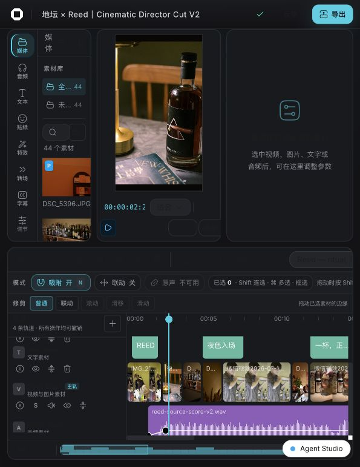
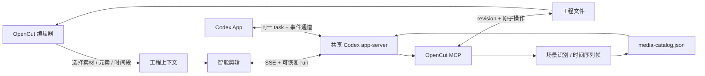

# OpenCut Classic · Agent-Drivable

本地优先、可被 Agent 精确控制的视频编辑器。这个分支在 OpenCut Classic 的时间轴、
预览、属性面板与导出能力之上，打通了 OpenCut 编辑器、Codex App 和 OpenCut MCP：
用户可以在浏览器里选中素材、元素或时间段，直接交给 Codex 理解和修改；也可以在
Codex App 中继续同一个工程任务。

> 本仓库基于已经归档的
> [OpenCut Classic](https://github.com/opencut-app/opencut-classic) 开发。
> 上游的新版本位于 [opencut-app/opencut](https://github.com/opencut-app/opencut)；
> `feat/agent-drivable` 是本仓库维护的实验分支。



## 能做什么

- **完整剪辑工作台**：素材库、多轨时间轴、预览、关键帧、变速、调色、字幕、音频、
  导出队列与工程历史。
- **智能剪辑**：通过对话完成读取工程、拆分片段、重排时间轴、修改属性、字幕处理、
  素材理解和画面质检。
- **精确引用上下文**：引用当前选区、播放头附近时间段、素材库元素或时间轴元素，
  使用稳定的 `opencut://` URI 交给 Agent。
- **浏览器与 Codex App 双向续聊**：两端连接同一个 app-server、同一个原生 task 和
  同一条事件通道；会话名称与工程名称保持一致。
- **Agent 原子操作**：OpenCut MCP 提供工程读写、媒体场景检测、时间线取帧、实时标签页
  操作、渲染验证以及 revision 冲突保护。
- **本地素材与高画质输出**：预览按素材能力自动选择原片或代理，最终导出始终读取原片。

## 工作方式



工程文件是唯一事实来源。用户在界面中的修改会写入工程；Agent 每一轮先读取最新
revision，再通过 MCP 落盘。浏览器与 Codex App 只是在不同入口查看、续聊同一个原生
Codex task，不维护两份独立会话。

## 快速开始

### 环境要求

- [Bun](https://bun.sh/) 最新稳定版
- Node.js 20+；建议 Node.js 24，用于 ESLint 和生产构建
- [FFmpeg](https://ffmpeg.org/) 与 FFprobe，用于媒体探测、代理和导出
- 已登录的 Codex / ChatGPT 桌面 App，或可用的 Codex CLI
- Docker 与 Docker Compose（仅数据库、Redis 和完整自托管需要）

### 启动 Web 编辑器

```bash
git clone https://github.com/zvv1999/opencut-classic.git
cd opencut-classic
git switch feat/agent-drivable

bun install
cp apps/web/.env.example apps/web/.env.local

# 需要数据库功能时再启动
docker compose up -d db redis serverless-redis-http

bun run dev:web
```

打开 [http://127.0.0.1:3000](http://127.0.0.1:3000)，新建或进入工程。
`.env.example` 已包含本地开发默认值；只体验编辑器时可以不启动 Docker。

### 让浏览器与 Codex App 使用同一会话

OpenCut 默认在 `ws://127.0.0.1:48721` 按需启动共享 app-server。Codex App 只在进程
启动时选择传输，所以第一次使用或从旧版私有宿主迁移时：

1. 正常退出 Codex / ChatGPT 桌面 App。
2. 在仓库根目录运行：

   ```bash
   bun run codex:shared-app
   ```

3. 从编辑器打开“智能剪辑”，发送一条消息。
4. 在 Codex App 中会看到以工程名命名的同一个任务，可从任一端继续。

不要同时启动第二个私有 app-server。自定义端口时，OpenCut 与桌面 App 必须使用同一
WebSocket 地址。

## 推荐使用链路

1. **建立工程**：导入素材，完成基础轨道与画布设置。
2. **选择上下文**：在时间轴选择片段或范围，或在素材库选择一个或多个素材。
3. **进入智能剪辑**：点击“添加引用”确认上下文，然后用自然语言描述结果。
4. **选择性能档位**：确定性修改用“快速”，日常编辑用“均衡”，镜头判断和最终验收用
   “导演”。
5. **观察执行**：回复、工具调用和工程修改持续流式展示；断线后会恢复同一个 run。
6. **人工复核**：在编辑器里播放、微调；下一轮 Agent 会重新读取人工修改后的 revision。
7. **跨端续聊**：需要更完整的 Codex 工作区体验时，直接在 Codex App 打开同名任务。

示例指令：

```text
把我选中的 21.3–29.0 秒压到 5 秒左右，保留人物动作起点和落点，不要改其他片段。

分析这三个素材的场景变化，为 30 秒竖屏短片挑选可用区间并先给出方案。

保留我刚才手动调整的切点，把后半段节奏再收紧，并在落点前加 4 帧缓冲。
```

## 性能与画质档位

| 档位 | 推理强度 | 画面识别 | 回写验证 | 适用场景 |
| --- | --- | --- | --- | --- |
| 快速 | `low` | 关闭 | 关闭 | 文案、重命名、确定性的简单修改 |
| 均衡（默认） | `medium` | 关闭 | 基础 | 日常剪辑与 revision 落盘确认 |
| 导演 | `xhigh` | 自动 | 完整 | 镜头判断、节奏重排、多模态与画面质检 |

当前链路针对交互和首字延迟做了以下处理：

- 本地会话投影先恢复界面，原生 `thread/read` 在后台校准，不阻塞输入框；
- 模型、模式和技能能力发现使用 5 分钟缓存与并发请求合并；
- 普通回合用 `read_project` 直接完成 MCP 就绪校验与工程预读，不再等待全量 MCP
  状态枚举；只有导演级能力发现或失败诊断才读取完整工具目录；
- task 命名在后台完成，不阻塞 `turn/start`；
- SSE 每 15 秒发送心跳，长任务经过代理时不易被空闲断开；
- 流式期间自动跟随最新内容，用户向上查看历史后不会被强制拉回；
- run 具备序列号、重连和遗漏事件补偿；多标签页使用 BroadcastChannel 与 ETag 同步；
- 高分辨率、高帧率、高码率或浏览器不兼容素材自动生成高画质代理；
- 代理只用于交互预览，导出使用原始素材，避免用响应速度换最终画质。

## 配置

常用环境变量位于 `apps/web/.env.example`：

```bash
# 桌面 App 内置 Codex CLI
CODEX_BIN=/Applications/ChatGPT.app/Contents/Resources/codex

# OpenCut 与 Codex App 共享的 app-server
OPENCUT_CODEX_APP_SERVER_URL=ws://127.0.0.1:48721

# 可选：Codex App 中归类 task 的工作区根目录
OPENCUT_CODEX_WORKSPACE_ROOT=/absolute/path/to/chatcut

# 可选：工程文件目录
OPENCUT_PROJECTS_DIR=/absolute/path/to/opencut-projects

# 可选：关闭自动导航到桌面任务；不影响会话与事件同步
OPENCUT_CODEX_DESKTOP_SYNC=0
```

项目级 `.codex/config.toml` 已注册 `opencut` MCP，并显式使用 Bun 启动。不要改用缺少
原生 `fetch` 的旧 Node，也不要为智能剪辑注册 LocalCut。

## 目录

```text
apps/web/       Next.js 编辑器、智能剪辑 UI、API 与共享 app-server 客户端
apps/mcp/       OpenCut MCP：工程文件、媒体分析和实时编辑器原子能力
apps/desktop/   GPUI 原生桌面壳（开发中）
rust/           GPU 合成、效果、遮罩和 WASM 核心
docs/           架构、路线图、验收报告与 Agent 工作规范
```

进一步阅读：

- [智能剪辑双向工作流与 Agent 操作规范](docs/agent-smart-edit.md)
- [编辑器目标计划](docs/roadmap/opencut-editor-goal-plan.md)
- [编解码与画质目标计划](docs/roadmap/opencut-codec-goal-plan.md)
- [编辑器功能与截图报告](docs/reports/opencut-editor-goal/index.html)
- [编解码、播放与导出报告](docs/reports/opencut-codec-goal/index.html)
- [关键帧架构](docs/keyframes.md)
- [颜色处理链路](docs/architecture/color-pipeline.md)

## 开发与验证

```bash
# Agent、会话、路由与交互回归
bun test apps/web/src/agent/__tests__
bun test apps/web/src/components/editor/__tests__/agent-surface-separation.test.ts
bun test apps/web/src/server/__tests__/codex-chat.test.ts
bun test apps/web/src/server/__tests__/codex-run-manager.test.ts
bun test apps/web/src/server/__tests__/codex-chat-route.test.ts

# MCP、全量测试和发布门禁
node --test apps/mcp/src/__tests__/*.test.mjs
bun test
bun run typecheck:web
bun run lint:web
bun run build:web
bun audit
```

测试遵循先写失败回归、再实现修复的方式。提交前至少运行受影响模块测试、类型检查、
ESLint、生产构建和依赖审计。

## 常见问题

| 现象 | 处理 |
| --- | --- |
| `Codex mcpServerStatus/list 请求超时` | 首次冷启动允许 MCP 初始化；确认 `.codex/config.toml` 使用 `bun`，然后重试。 |
| 浏览器有回复，Codex App 没有回显 | 退出桌面 App 后运行 `bun run codex:shared-app`，确认两端连接同一端口。 |
| task 已归档，无法续聊 | 执行 `codex unarchive <threadId>`，或在智能剪辑中新建会话。 |
| `fetch is not defined` | MCP 被旧 Node 启动；恢复项目配置中的 Bun 启动方式。 |
| 页面刷新后仍显示处理中 | 保留原 run 并等待自动重连；不要重复发送同一条剪辑指令。 |
| Codex App 续聊缺少 OpenCut 工具 | 检查 task 工作区的 `.codex/config.toml` 是否注册 `mcp_servers.opencut`。 |
| `revision_conflict` | 重新读取工程并基于新 revision 生成操作，不要盲目重试。 |
| `noEffect: true` | 操作执行但没有改变结果；检查轨道、元素选择和时间范围。 |
| 预览卡顿但导出正常 | 等待代理任务完成；代理只影响预览，最终导出仍使用原片。 |

更多协议、上下文 JSON、媒体目录和故障处理细节见
[docs/agent-smart-edit.md](docs/agent-smart-edit.md)。

## 上游、贡献与许可证

这个分支延续 OpenCut “隐私、本地优先、简单易用”的方向，并针对时间轴、媒体处理、
Agent 协作和专业编辑体验持续迭代。提交改动前请阅读
[贡献指南](.github/CONTRIBUTING.md)。

感谢 [Vercel](https://vercel.com?utm_source=github-opencut&utm_campaign=oss) 和
[fal.ai](https://fal.ai?utm_source=github-opencut&utm_campaign=oss) 对原项目的支持。

本项目采用 [MIT License](LICENSE)。
