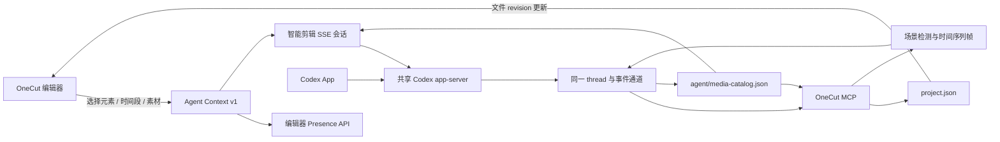

# OneCut × Codex 智能剪辑工作流

本文是 OneCut `agent-drivable` 工程的 Agent 操作规范。目标是让编辑器内的
“智能剪辑”和 Codex App 中的工程会话共享同一份上下文、素材理解结果和工程文件，
并允许用户与 Agent 反复交替编辑。

## 1. 双向链路



有两个等价入口：

1. **OneCut 内置智能剪辑**：编辑器把当前引用上下文随消息发送到
   `/api/codex/chat`，服务端通过 Codex app-server 流式返回文本和 MCP 活动。
2. **Codex App 工程会话**：仓库和 Codex App 保存工程所对应的工作区目录都注册
   `opencut` MCP。Codex 可调用 `get_active_project` 找到最近活跃的编辑器，再通过
   `read_agent_context` 读取用户当前选中的上下文。

工程文件是两条链路共同的事实来源。Agent 用文件工具写入后，已打开的编辑器会跟随
新的文件 revision；用户在界面中的后续编辑又会成为 Agent 下一次读取到的新状态。

内置智能剪辑不会把“寻找工具、连接 MCP、寻找当前工程”交给模型。每一轮固定先完成：

1. 启动或恢复当前工程对应的 Codex thread；
2. 用 `mcpServer/tool/call` 直接预读当前 `projectId` 的
   `read_project(detail: "summary")`；调用成功同时证明 `opencut` 已就绪；
3. 只有画面识别或完整回写验证需要扩展工具时，才用 `mcpServerStatus/list`
   读取完整工具目录；普通回合失败时也会调用它生成具体诊断；
4. 把工程摘要与 `opencut.agent-context.v1` 一起放入本轮输入，再调用
   `turn/start`。

任一步失败都在模型开始回复前终止并显示具体错误。共享宿主始终显式启用
`opencut`、始终禁用 `localcut`，并装载 Codex App 已配置的其他能力。工具档位只用于
约束本轮的工作重点和验收深度，不再切换 app-server：

- **专注剪辑**：本轮只使用 OneCut；
- **剪辑与验收**：本轮可使用 Node REPL、桌面/浏览器验收和 OpenAI 官方文档能力；
- **完整能力**：本轮可使用 Codex App 已配置的其他 MCP，仍强制禁用 LocalCut。

三个档位复用同一个长驻 WebSocket app-server 和同一条客户端连接，避免切换档位时
thread 被带到另一个宿主。档位是本轮 Agent 的行为边界，不再通过不同进程隐藏工具。
模型、推理强度、执行/规划模式、技能目录均由 app-server 的原生 `model/list`、
`collaborationMode/list`、`skills/list` 返回，不在前端硬编码成一套弱化能力。

### 性能与画质档位

智能剪辑把影响首字延迟、工具权限和画面验收成本的选项收敛为三个预设；预设不会更换
Codex 内核，只调整当前任务所需的推理、工具和验证深度：

| 档位         | 推理     | 工具       | 画面识别 | 回写验证 | 适用场景                                         |
| ------------ | -------- | ---------- | -------- | -------- | ------------------------------------------------ |
| 快速         | `low`    | 专注剪辑   | 关闭     | 关闭     | 文案、重命名和确定性的简单修改                   |
| 均衡（默认） | `medium` | 专注剪辑   | 关闭     | 基础     | 日常剪辑；回读 revision 确认落盘，不阻塞等待渲染 |
| 导演         | `xhigh`  | 剪辑与验收 | 自动     | 完整     | 镜头判断、节奏重排、关键画面和最终质量验收       |

自动档会根据指令和显式引用决定是否取帧。均衡档不在每一轮强制生成联系表或渲染帧，
因此普通对话能更快开始流式返回；需要视觉证据时切换“导演”即可恢复多模态识别、
编辑器同步等待和关键画面验证。

编辑器先从本地会话投影恢复 UI，并在后台用原生 `thread/read` 校准，历史同步不会阻塞
输入框。能力发现使用五分钟缓存和并发请求合并；普通回合用 `read_project` 直接完成
MCP 就绪校验和工程预读，避免全量 MCP 状态枚举拖慢首轮；task 命名也不再阻塞
`turn/start`。SSE 每 15 秒发送心跳，长任务可通过 run 序列号恢复并补齐遗漏事件。
流式回复默认跟随最新一行；用户主动向上查看历史后则保持当前位置。

素材预览也使用独立的性能策略：浏览器不兼容的编码、分辨率达到 2560×1440、帧率
高于 30 fps 或码率高于 20 Mbps 时自动生成代理。大分辨率素材使用长边 1440 的
高画质代理，其余素材使用标准代理；代理只服务编辑预览，最终导出始终读取原始素材。
磁盘素材库只读取一次索引，并以最多四路并发加载媒体，避免每个素材重复拉取索引形成
串行瀑布。

## 2. Codex App 配置

仓库已经包含以下项目级配置：

```toml
[mcp_servers.opencut]
command = "bun"
args = ["apps/mcp/src/server.mjs"]
cwd = "."
startup_timeout_sec = 30.0

[mcp_servers.opencut.env]
OPENCUT_BASE_URL = "http://127.0.0.1:3000"
OPENCUT_PROJECTS_DIR = "../opencut-projects"
```

必须使用 Bun 启动 MCP。当前运行环境中的旧版 Node 不提供服务所需的原生
`fetch`。这份配置只注册 OneCut，不依赖 LocalCut。

智能剪辑 task 在 Codex App 中归入上层工作区时，服务端会在首次打开桌面任务前确保
`<workspace>/.codex/config.toml` 也包含等价的 `opencut` 配置。自动写入只追加带
`BEGIN/END OPENCUT MANAGED MCP` 标记的区块；若用户已经配置
`[mcp_servers.opencut]`，则完全保留用户版本。共享宿主同时通过启动参数显式装载
OneCut MCP；工作区配置作为用户从非共享入口启动 Codex 时的兼容兜底。

编辑器每 5 秒发布一次心跳。Codex App 中的标准入口顺序是：

1. `get_active_project`
2. `read_agent_context`
3. 根据任务选择素材理解或工程编辑工具

Presence 超过 45 秒没有更新就不再视为活跃编辑器。上下文负载上限为 128 KiB。

## 3. 快速选择上下文

智能剪辑对话框中的“添加引用”支持：

- 当前时间轴选择；
- 当前播放头附近的时间段；
- 手工输入精确开始、结束秒数；
- 素材库与时间轴元素搜索；
- 批量引用当前搜索结果；
- 复制供 Agent 读取的 JSON。

引用使用稳定的 `opencut://` URI：

```text
opencut://project/<projectId>/scene/<sceneId>/track/<trackId>/element/<elementId>
opencut://project/<projectId>/scene/<sceneId>/range?start=1.000&end=4.000
opencut://project/<projectId>/media/<mediaId>
```

上下文优先级固定为：

1. 用户显式固定的引用；
2. 当前时间轴选择；
3. 没有引用时仍携带当前工程、轨道、素材和播放头信息，并由服务端预读工程摘要。

`opencut.agent-context.v1` 同时包含：

- `project.revision`：文件工具 `read_project/edit_project` 使用的 CAS revision；
- `project.editorRevision`：仅供实时编辑器/CDP 命令使用；
- `references`：用户直接选中的引用；
- `timelineElements`：直接引用或时间段内解析到的元素；
- `media`：这些元素关联的素材技术信息；
- `workflow`：推荐的读取、编辑、素材目录和时间段识别工具。

不要混用文件 revision 与 editor revision。智能剪辑默认走文件工具。

## 4. 素材 JSON

每个工程的 Agent 素材目录位于：

```text
<OPENCUT_PROJECTS_DIR>/<projectId>/agent/media-catalog.json
```

使用 `build_media_catalog` 创建或刷新目录，使用 `read_media_catalog` 读取。
刷新会保留已完成的多模态分析。目录 schema 为
`opencut.media-catalog.v1`，每个素材包含：

```json
{
	"id": "media-id",
	"name": "shot.mov",
	"type": "video",
	"uri": "opencut://project/project-id/media/media-id",
	"technical": {
		"durationSeconds": 24.7,
		"width": 1080,
		"height": 1920,
		"fps": 30,
		"hasAudio": true,
		"sizeBytes": 12345678
	},
	"timelineUses": [
		{
			"sceneId": "scene-id",
			"trackId": "track-id",
			"elementId": "element-id",
			"timelineStartSeconds": 1,
			"timelineEndSeconds": 4,
			"sourceStartSeconds": 8,
			"sourceEndSeconds": 11
		}
	],
	"analysis": {
		"status": "ready",
		"provider": "codex-multimodal",
		"summary": "画面摘要",
		"tags": ["室内", "人物"],
		"scenes": []
	}
}
```

目录刻意排除缩略图、base64、对象 URL 和私有 `storageId`，以便 Agent 快速读取，
同时避免把大体积或浏览器私有数据放进提示词。

## 5. 视频识别与多模态分析

### 识别完整源视频

调用 `inspect_media_scenes`。它会：

1. 用 FFmpeg 场景变化检测寻找镜头边界；
2. 为每个镜头选择代表帧；
3. 对没有明显切点的长镜头按时间连续取样，默认约每 3 秒覆盖一次；
4. 返回带时间映射的 JPEG 联系表。

Codex 直接查看联系表，识别人、物、动作、环境、镜头类型、运镜、屏幕文字和质量问题，
然后调用 `save_media_analysis` 保存可复用结果。

### 识别时间轴片段

引用时间段时调用 `inspect_timeline_range`。工具先在时间轴上均匀选择时刻，再映射回
源素材时间。映射会处理：

- `trimStart`；
- 常规变速；
- 曲线变速；
- 倒放；
- 同时覆盖时间段的主轨与叠加轨。

返回结果使用 `opencut.timeline-inspection.v1`，并同时给出 timeline time、
source time、asset、track 和 element 的对应关系。这样 Agent 理解的是用户实际
选择的剪辑片段，而不是源视频中错误的时刻。

### 保存分析

查看图片后调用：

```text
save_media_analysis(projectId, assetId, analysis)
```

`analysis.provider` 推荐使用 `codex-multimodal`。后续会话优先复用
`read_media_catalog` 中 `status: "ready"` 的结果；当素材变更、分析不足或用户
要求重新判断时再取帧。

本地 FFmpeg + Codex 多模态是默认路径，不要求上传素材。如果部署环境允许公开素材
并配置了 AI 中台，也可以把抽帧、视频分类或图片理解接到外部异步任务；不要在没有
凭据、可访问 URL 或明确部署配置时猜测调用参数。

## 6. Agent 编辑协议

所有剪辑 Agent 遵循下面的执行顺序：

1. 用 `read_project(detail: "summary")` 快速了解工程。
2. 需要精确操作时再用 `read_project(detail: "full")`。
3. 需要理解画面时读取素材目录，并按需调用 `inspect_media_scenes` 或
   `inspect_timeline_range`。
4. 基于刚读取到的 `revision` 生成一批原子操作。
5. 用 `edit_project` 一次提交，传入 `baseRevision` 和稳定的
   `idempotencyKey`。
6. 检查返回值中的 `applied`、`noEffect`、`deduplicated` 与新 revision。
7. 若返回 `revision_conflict`，重新读取、重新判断后再提交；不能只把 revision
   数字改大。
8. 如果下一步依赖打开的编辑器画面或要交还给用户，调用 `wait_for_sync` 等待界面
   跟上文件 revision。

`edit_project` 是全有或全无的：批次中任一步失败，工程文件不会出现半完成状态。
普通编辑被标为可恢复的 mutation；`delete_project`、`delete_media` 仍是明确的
破坏性工具。

内置智能剪辑使用 `approvalPolicy: "never"`。客户端只自动接受
`serverName: "opencut"` 且 `_meta.codex_approval_kind: "mcp_tool_call"` 的
MCP 工具审批，并只在当前会话持久化；其他服务器或普通表单 elicitation 会被拒绝。

## 7. SSE 会话

`POST /api/codex/chat` 接收：

```json
{
	"projectId": "project-id",
	"message": "把这段收紧并统一字幕",
	"context": "<opencut-context>...</opencut-context>",
	"conversationId": "工程内的会话 ID",
	"sessionId": "可选，继续同一 Codex thread",
	"model": "gpt-5.6-sol",
	"effort": "xhigh",
	"mode": "default",
	"toolProfile": "verify",
	"visualMode": "auto",
	"verificationMode": "full"
}
```

响应为 `text/event-stream`：

- `run`：可重连后台任务 ID、状态和最新事件序号；
- `session`：Codex thread/session ID；
- `turn`：当前原生 turn ID，供追加与停止使用；
- `delta`：模型文本增量；
- `protocol`：Codex/app-server 的实时执行步骤；内置智能剪辑将其渲染为面向用户的
  单行处理状态，默认只显示最新动作，可展开最近的用户可读步骤；方法名、内部类型和
  执行详情不直接展示；
- `done`：本轮权威最终消息；
- `error`：连接、工具或本轮失败。

前端必须逐条消费 `delta`，不能等待 `done` 后一次性替换内容。传回 `sessionId` 可让
用户在同一个智能剪辑对话中继续要求二次修改。

### 原生 App 能力与控制

`GET /api/codex/capabilities` 返回当前桌面 Codex 实际可用的模型、推理强度、协作
模式、技能和工具档位。前端选择会直接进入 `thread/start` / `thread/resume` 和
`turn/start`，不是只改变界面文案：

- `mode: "default"` 为执行模式，允许通过 `edit_project` 落回工程；
- `mode: "plan"` 为规划模式，只读取和分析，不修改工程；
- `visualMode: "auto"` 会优先识别显式时间段、所选时间线元素或首个视觉素材，把
  `inspect_timeline_range` / `inspect_media_scenes` 返回的联系表转换成 app-server
  原生 `image` 输入；
- `verificationMode: "full"` 会在 turn 完成后回读 revision、等待编辑器同步，并在
  支持时调用 `render_frames` 生成关键画面证据。验证失败只标记证据失败，不覆盖
  Codex 已完成的回复。

处理中不锁死输入框。以下操作走 app-server 原生协议：

```text
PUT /api/codex/chat { action: "steer", runId, message }     -> turn/steer
PUT /api/codex/chat { action: "interrupt", runId }          -> turn/interrupt
PUT /api/codex/chat { action: "compact", runId|sessionId }  -> thread/compact/start
```

追加指令进入正在运行的同一 turn；停止只终止该 turn，不删除 thread 和工程历史。

### 可重连后台任务

浏览器连接和 Codex 执行生命周期已经分离。`POST` 创建后台 `runId` 后，关闭面板、
刷新页面或 SSE 断线不会中断 App turn。服务端为每个运行保留带序号的最近 2000 个
事件；前端把 `runId`、`turnId`、`runSequence` 随流式消息写入工程会话文件，并通过：

```text
GET /api/codex/chat?runId=<runId>&after=<runSequence>
```

从最后一个已保存事件继续。已结束任务保留两小时供页面恢复；订阅者断开只结束本次
SSE 消费，不会对 Codex 发送 interrupt。

### 工程级会话一致性

Codex App Server 的 task/thread 是对话正文的唯一事实来源。一个工程可以绑定多条
独立 task，每条绑定都有自己的 `conversationId`、标题和 Codex `sessionId`。用户
新建会话或选择历史会话时，浏览器必须传回该绑定自己的 `sessionId`，通过
`thread/resume` 从原上下文继续；禁止把不同会话的消息或 Codex thread 合并。
服务端为了覆盖“session 事件已经生成、浏览器还没来得及保存就断线”的短暂窗口，会
保留进程内 session 缓存；缓存键必须是 `(projectId, conversationId)`，不能只按工程
缓存。显式传入的 `sessionId` 始终优先于这个恢复缓存。

工程目录的 `agent/codex-conversation.json` 是项目到 task 的绑定索引和 UI 投影缓存，
不是第二份对话事实源。它保存浏览器所需的引用数量、可重连 `runId/runSequence` 和
用户可读处理步骤，使断线中的流式会话可以恢复。读取已绑定会话时，服务端固定调用：

```text
thread/read(threadId: sessionId, includeTurns: true)
```

随后用 App Server 返回的 turns **权威替换**缓存正文。只存在于旧浏览器缓存、但不在
原生 task 中的消息必须删除；按消息 ID 或 turn ID 匹配到的 UI 元数据可以保留。任务
正在流式执行时，浏览器可以暂存尚未出现在 `thread/read` 中的乐观消息；任务空闲后
下一次同步必须恢复为原生历史。由 Codex App 任务转发入口产生的
`<codex_delegation>` 消息只展示其 `<input>` 内容，不把宿主协议壳暴露给用户。旧版
`opencut.codex-conversation.v1` 文件读取时会迁移为一条 `legacy-conversation`，
首次成功读取其 App task 后同样遵守这一规则。

智能剪辑入口通过 `GET /api/codex/history/:projectId?conversationId=...` 读取并校准所选
task，通过 `POST /api/codex/history/:projectId` 保存绑定和流式 UI 投影。同源页面使用
`BroadcastChannel` 即时通知：同源标签页收到通知后只读取本地投影，不重复触发
`thread/read`。历史接口返回 revision 对应的 `ETag`，客户端通过
`If-None-Match` 复用未改变的结果；`304` 不传输会话正文。页面重新可见、窗口聚焦时
立即执行一次权威原生同步，另以页面可见时每 15 秒一次的同步作为跨窗口、跨浏览器和
通知丢失时的兜底。消息 ID 必须使用 UUID；页面写入采用按 `updatedAt` 的增量合并，
避免一个标签页用旧快照覆盖另一个标签页的新流式状态。关闭面板、刷新页面或在 Codex
App 继续对话后，下一次权威 `thread/read` 都必须得到相同正文。

这不是把 Codex App 窗口嵌入网页。浏览器只实现轻量展示和 OneCut 引用交互，
认证、任务历史、续聊、模型执行与流式事件均使用 Codex 原生 App Server 协议。
OneCut 和 Codex App 必须连接同一个 loopback WebSocket 宿主；默认地址为：

```bash
OPENCUT_CODEX_APP_SERVER_URL=ws://127.0.0.1:48721
```

OneCut 在首次请求能力或发起会话时检查 `/readyz`，宿主不存在时以当前 Codex
运行时自动启动一次；同一 OneCut 服务进程内的所有工具档位、API 路由和工程会话
复用一个 WebSocket 客户端。Codex App 使用同一个 URL 启动后，会对打开或恢复的
thread 建立自己的订阅；浏览器和桌面端因此从同一宿主读取同一 task，并接收同一轮
事件，不再依赖“两份 app-server + 落盘后刷新”的伪同步。

Codex App 只在进程启动时选择传输，因此从旧版私有 stdio 宿主迁移需要正常退出一次
桌面 App，然后在 OneCut 仓库执行：

```bash
bun run codex:shared-app
```

启动器先触发 OneCut 建立共享宿主，再以
`CODEX_APP_SERVER_WS_URL=ws://127.0.0.1:48721` 启动桌面 App。若 App 仍在运行，
启动器会停止并提示先退出，避免同时出现一个私有宿主和一个共享宿主。之后浏览器与
桌面端可以在同一 task 上继续对话；切换工具档位、刷新网页或关闭智能剪辑面板都不会
改变宿主。自定义端口时，OneCut 环境变量和桌面 App 启动环境必须使用同一个 URL。

### Codex App 工作区与任务可见性

OneCut 智能剪辑创建、恢复或迁移 task 时使用 `OPENCUT_CODEX_WORKSPACE_ROOT` 作为
`cwd`；未设置时默认使用 `opencut-classic` 的父目录。当前仓库布局下即
`opencut-classic` 所在的工作区：

```text
<workspace>/chatcut
```

同时 `runtimeWorkspaceRoots` 保留工作区根、`opencut-classic` 仓库和
`opencut-projects` 工程文件目录，OneCut MCP 的 `cwd` 仍是 `opencut-classic`。
因此 task 在 Codex App 的全局任务历史中可见、可打开和续聊，并同时具备当前编辑器
工程和 MCP 工具上下文。

每次 task 绑定工程时，服务端先通过 `read_project(detail: "summary")` 取得真实
`projectName`，再调用 `thread/name/set`。浏览器会话列表和 Codex App 因而统一显示
工程项目名；用户首条提问只作为正文和摘要，不再充当 task 标题。已有 task 从智能
剪辑再次续聊时也会被校准为当前工程名。

App Server 的 `thread/start`、`thread/resume`、`thread/fork` 协议只接受执行目录和
运行时根，不接受 Codex 桌面端项目的 `projectId`。OneCut 不修改
`.codex-global-state.json`，也不伪造宿主元数据。桌面 App 依据 task 的真实 `cwd`
把它归入已保存的 `chatcut` 项目。

浏览器启动或完成 turn 时仍可后台打开
`codex://threads/<threadId>`，但该深链只负责把桌面界面导航到目标 task，不参与数据
同步，也不再先跳转 `codex://threads/new` 强制卸载页面。正文、状态和流式事件全部
来自共享 app-server；`thread/read(includeTurns: true)` 只用于断线恢复和权威校准。
桌面 App 未安装、深链失败或设置 `OPENCUT_CODEX_DESKTOP_SYNC=0` 时，仅跳过自动导航，
不会影响共享事件、原生历史或工程编辑。

## 8. 二次编辑范式

用户和 Agent 可以按以下方式交替工作：

```text
用户选择 12–18 秒 → “节奏更紧”
Agent 读取上下文并识别该片段 → edit_project revision 42 → 43
编辑器跟随 revision 43，用户手工拖动一个切点 → revision 44
用户继续说“保留刚才手调的切点，再压短后半段”
Agent 重新 read_project revision 44 → 基于新状态提交 revision 45
```

Agent 不应缓存旧的 clip ID、track ID 或 revision。分割、替换和用户操作都可能改变
它们；每一轮都从当前文件重新读取。

## 9. 何时使用实时标签页工具

默认不要调用 `status`、`get_context`、`open_editor` 或 `reveal_context`。
OneCut 内置智能剪辑已经随消息携带上下文，Codex App 则通过 Presence API 获取。

只有以下能力需要实时标签页/CDP：

- 需要把 `opencut://` 引用重新选中并移动播放头；
- 需要读取编辑器当前渲染像素；
- 需要进入与人工操作共享的 undo/redo 历史；
- 文件工具明确拒绝的动画关键帧分割；
- 导出前等待并验证浏览器内存中的工程状态。

## 10. 故障排查

| 现象                          | 处理                                                                                         |
| ----------------------------- | -------------------------------------------------------------------------------------------- |
| `get_active_project` 没有结果 | 确认工程页已打开，等待下一次 5 秒心跳，并检查 `/api/editor-presence`。                       |
| `fetch is not defined`        | MCP 被旧 Node 启动；改用项目配置中的 `bun`。                                                 |
| `edit_project` 一直 started   | 检查 app-server 客户端是否响应 `mcpServer/elicitation/request`。                             |
| 页面刷新后仍显示处理中        | 检查消息是否保存 `runId/runSequence`，再调用重连接口；不要新开 turn。                        |
| Codex App 续聊缺少 OneCut    | 检查 task 的 `cwd` 所在工作区 `.codex/config.toml` 是否包含 `mcp_servers.opencut`。          |
| 选区没有作为图片输入          | 确认开启“自动识别选区画面”，且 MCP 暴露 `inspect_timeline_range` 或 `inspect_media_scenes`。 |
| 完整能力仍缺少某个工具        | 先查看 `~/.codex/config.toml` 是否配置该 MCP；工具档位不会凭空安装服务。                     |
| `revision_conflict`           | 重新 `read_project`，重新生成操作，不要盲重试。                                              |
| `noEffect: true`              | 操作执行了但被编辑器规则抵消；检查轨道/元素组合。                                            |
| 时间轴画面识别错位            | 使用 `inspect_timeline_range`，不要把 timeline time 直接当 source time。                     |
| 素材目录仍是未处理            | 取帧并完成多模态判断后调用 `save_media_analysis`。                                           |

## 11. 验证命令

```bash
bun test apps/web/src/agent/__tests__
bun test apps/web/src/lib/media/__tests__/media-loading.test.ts
bun test apps/web/src/components/editor/__tests__/agent-surface-separation.test.ts
bun test apps/web/src/server/__tests__/codex-chat.test.ts
bun test apps/web/src/server/__tests__/codex-run-manager.test.ts
bun test apps/web/src/server/__tests__/codex-chat-route.test.ts
node --test apps/mcp/src/__tests__/*.test.mjs
bun test
bun run typecheck:web
bun run lint:web
bun run build:web
bun audit
```

`build:web` 会执行 Next.js 的生产 TypeScript 检查。构建和 ESLint 需要 Node 20+
（推荐使用当前 Codex 桌面运行时自带的 Node）；系统 Node 16 缺少
`structuredClone`，不能作为有效的规范检查环境。

真实 E2E 应使用专门的临时工程完成：

1. 通过智能剪辑发送一条确定性的新增文本指令；
2. 观察 SSE 中 `read_project`、`edit_project` 均 completed；
3. 回读工程，确认时间、时长、内容与 revision；
4. 删除临时工程，不能用正式素材工程做破坏性验收。
