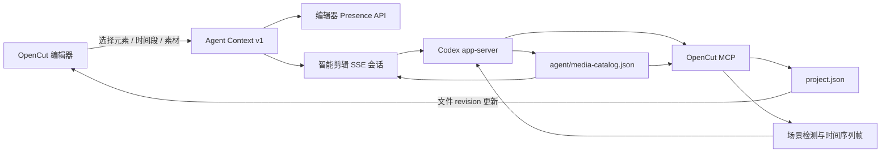

# OpenCut × Codex 智能剪辑工作流

本文是 OpenCut `agent-drivable` 工程的 Agent 操作规范。目标是让编辑器内的
“智能剪辑”和 Codex App 中的工程会话共享同一份上下文、素材理解结果和工程文件，
并允许用户与 Agent 反复交替编辑。

## 1. 双向链路



有两个等价入口：

1. **OpenCut 内置智能剪辑**：编辑器把当前引用上下文随消息发送到
   `/api/codex/chat`，服务端通过 Codex app-server 流式返回文本和 MCP 活动。
2. **Codex App 工程会话**：项目根目录的 `.codex/config.toml` 注册 `opencut`
   MCP。Codex 可调用 `get_active_project` 找到最近活跃的编辑器，再通过
   `read_agent_context` 读取用户当前选中的上下文。

工程文件是两条链路共同的事实来源。Agent 用文件工具写入后，已打开的编辑器会跟随
新的文件 revision；用户在界面中的后续编辑又会成为 Agent 下一次读取到的新状态。

内置智能剪辑不会把“寻找工具、连接 MCP、寻找当前工程”交给模型。每一轮固定先完成：

1. 启动或恢复当前工程对应的 Codex thread；
2. 用 `mcpServerStatus/list` 校验 `opencut` 已注册，且至少暴露
   `read_project`、`edit_project`；
3. 用 `mcpServer/tool/call` 预读当前 `projectId` 的
   `read_project(detail: "summary")`；
4. 把工程摘要与 `opencut.agent-context.v1` 一起放入本轮输入，再调用
   `turn/start`。

任一步失败都在模型开始回复前终止并显示具体错误。服务启动时会禁用用户全局配置中的
其他 MCP，只为内置智能剪辑显式启用 `opencut`，因此不会误入 LocalCut 或把启动时间
消耗在无关工具上。

## 2. Codex App 配置

仓库已经包含以下项目级配置：

```toml
[mcp_servers.opencut]
command = "bun"
args = ["apps/mcp/src/server.mjs"]
cwd = "."
startup_timeout_sec = 30.0

[mcp_servers.opencut.env]
OPENCUT_BASE_URL = "http://127.0.0.1:3000"
OPENCUT_PROJECTS_DIR = "../opencut-projects"
```

必须使用 Bun 启动 MCP。当前运行环境中的旧版 Node 不提供服务所需的原生
`fetch`。这份配置只注册 OpenCut，不依赖 LocalCut。

编辑器每 5 秒发布一次心跳。Codex App 中的标准入口顺序是：

1. `get_active_project`
2. `read_agent_context`
3. 根据任务选择素材理解或工程编辑工具

Presence 超过 45 秒没有更新就不再视为活跃编辑器。上下文负载上限为 128 KiB。

## 3. 快速选择上下文

智能剪辑对话框中的“添加引用”支持：

- 当前时间轴选择；
- 当前播放头附近的时间段；
- 手工输入精确开始、结束秒数；
- 素材库与时间轴元素搜索；
- 批量引用当前搜索结果；
- 复制供 Agent 读取的 JSON。

引用使用稳定的 `opencut://` URI：

```text
opencut://project/<projectId>/scene/<sceneId>/track/<trackId>/element/<elementId>
opencut://project/<projectId>/scene/<sceneId>/range?start=1.000&end=4.000
opencut://project/<projectId>/media/<mediaId>
```

上下文优先级固定为：

1. 用户显式固定的引用；
2. 当前时间轴选择；
3. 没有引用时仍携带当前工程、轨道、素材和播放头信息，并由服务端预读工程摘要。

`opencut.agent-context.v1` 同时包含：

- `project.revision`：文件工具 `read_project/edit_project` 使用的 CAS revision；
- `project.editorRevision`：仅供实时编辑器/CDP 命令使用；
- `references`：用户直接选中的引用；
- `timelineElements`：直接引用或时间段内解析到的元素；
- `media`：这些元素关联的素材技术信息；
- `workflow`：推荐的读取、编辑、素材目录和时间段识别工具。

不要混用文件 revision 与 editor revision。智能剪辑默认走文件工具。

## 4. 素材 JSON

每个工程的 Agent 素材目录位于：

```text
<OPENCUT_PROJECTS_DIR>/<projectId>/agent/media-catalog.json
```

使用 `build_media_catalog` 创建或刷新目录，使用 `read_media_catalog` 读取。
刷新会保留已完成的多模态分析。目录 schema 为
`opencut.media-catalog.v1`，每个素材包含：

```json
{
  "id": "media-id",
  "name": "shot.mov",
  "type": "video",
  "uri": "opencut://project/project-id/media/media-id",
  "technical": {
    "durationSeconds": 24.7,
    "width": 1080,
    "height": 1920,
    "fps": 30,
    "hasAudio": true,
    "sizeBytes": 12345678
  },
  "timelineUses": [
    {
      "sceneId": "scene-id",
      "trackId": "track-id",
      "elementId": "element-id",
      "timelineStartSeconds": 1,
      "timelineEndSeconds": 4,
      "sourceStartSeconds": 8,
      "sourceEndSeconds": 11
    }
  ],
  "analysis": {
    "status": "ready",
    "provider": "codex-multimodal",
    "summary": "画面摘要",
    "tags": ["室内", "人物"],
    "scenes": []
  }
}
```

目录刻意排除缩略图、base64、对象 URL 和私有 `storageId`，以便 Agent 快速读取，
同时避免把大体积或浏览器私有数据放进提示词。

## 5. 视频识别与多模态分析

### 识别完整源视频

调用 `inspect_media_scenes`。它会：

1. 用 FFmpeg 场景变化检测寻找镜头边界；
2. 为每个镜头选择代表帧；
3. 对没有明显切点的长镜头按时间连续取样，默认约每 3 秒覆盖一次；
4. 返回带时间映射的 JPEG 联系表。

Codex 直接查看联系表，识别人、物、动作、环境、镜头类型、运镜、屏幕文字和质量问题，
然后调用 `save_media_analysis` 保存可复用结果。

### 识别时间轴片段

引用时间段时调用 `inspect_timeline_range`。工具先在时间轴上均匀选择时刻，再映射回
源素材时间。映射会处理：

- `trimStart`；
- 常规变速；
- 曲线变速；
- 倒放；
- 同时覆盖时间段的主轨与叠加轨。

返回结果使用 `opencut.timeline-inspection.v1`，并同时给出 timeline time、
source time、asset、track 和 element 的对应关系。这样 Agent 理解的是用户实际
选择的剪辑片段，而不是源视频中错误的时刻。

### 保存分析

查看图片后调用：

```text
save_media_analysis(projectId, assetId, analysis)
```

`analysis.provider` 推荐使用 `codex-multimodal`。后续会话优先复用
`read_media_catalog` 中 `status: "ready"` 的结果；当素材变更、分析不足或用户
要求重新判断时再取帧。

本地 FFmpeg + Codex 多模态是默认路径，不要求上传素材。如果部署环境允许公开素材
并配置了 AI 中台，也可以把抽帧、视频分类或图片理解接到外部异步任务；不要在没有
凭据、可访问 URL 或明确部署配置时猜测调用参数。

## 6. Agent 编辑协议

所有剪辑 Agent 遵循下面的执行顺序：

1. 用 `read_project(detail: "summary")` 快速了解工程。
2. 需要精确操作时再用 `read_project(detail: "full")`。
3. 需要理解画面时读取素材目录，并按需调用 `inspect_media_scenes` 或
   `inspect_timeline_range`。
4. 基于刚读取到的 `revision` 生成一批原子操作。
5. 用 `edit_project` 一次提交，传入 `baseRevision` 和稳定的
   `idempotencyKey`。
6. 检查返回值中的 `applied`、`noEffect`、`deduplicated` 与新 revision。
7. 若返回 `revision_conflict`，重新读取、重新判断后再提交；不能只把 revision
   数字改大。
8. 如果下一步依赖打开的编辑器画面或要交还给用户，调用 `wait_for_sync` 等待界面
   跟上文件 revision。

`edit_project` 是全有或全无的：批次中任一步失败，工程文件不会出现半完成状态。
普通编辑被标为可恢复的 mutation；`delete_project`、`delete_media` 仍是明确的
破坏性工具。

内置智能剪辑使用 `approvalPolicy: "never"`。客户端只自动接受
`serverName: "opencut"` 且 `_meta.codex_approval_kind: "mcp_tool_call"` 的
MCP 工具审批，并只在当前会话持久化；其他服务器或普通表单 elicitation 会被拒绝。

## 7. SSE 会话

`POST /api/codex/chat` 接收：

```json
{
  "projectId": "project-id",
  "message": "把这段收紧并统一字幕",
  "context": "<opencut-context>...</opencut-context>",
  "sessionId": "可选，继续同一 Codex 会话"
}
```

响应为 `text/event-stream`：

- `session`：Codex thread/session ID；
- `delta`：模型文本增量；
- `protocol`：供服务端诊断的 Codex/app-server 协议步骤；内置智能剪辑会忽略这些事件，
  不在对话界面展示调用轨迹；
- `done`：本轮权威最终消息；
- `error`：连接、工具或本轮失败。

前端必须逐条消费 `delta`，不能等待 `done` 后一次性替换内容。传回 `sessionId` 可让
用户在同一个智能剪辑对话中继续要求二次修改。

## 8. 二次编辑范式

用户和 Agent 可以按以下方式交替工作：

```text
用户选择 12–18 秒 → “节奏更紧”
Agent 读取上下文并识别该片段 → edit_project revision 42 → 43
编辑器跟随 revision 43，用户手工拖动一个切点 → revision 44
用户继续说“保留刚才手调的切点，再压短后半段”
Agent 重新 read_project revision 44 → 基于新状态提交 revision 45
```

Agent 不应缓存旧的 clip ID、track ID 或 revision。分割、替换和用户操作都可能改变
它们；每一轮都从当前文件重新读取。

## 9. 何时使用实时标签页工具

默认不要调用 `status`、`get_context`、`open_editor` 或 `reveal_context`。
OpenCut 内置智能剪辑已经随消息携带上下文，Codex App 则通过 Presence API 获取。

只有以下能力需要实时标签页/CDP：

- 需要把 `opencut://` 引用重新选中并移动播放头；
- 需要读取编辑器当前渲染像素；
- 需要进入与人工操作共享的 undo/redo 历史；
- 文件工具明确拒绝的动画关键帧分割；
- 导出前等待并验证浏览器内存中的工程状态。

## 10. 故障排查

| 现象 | 处理 |
| --- | --- |
| `get_active_project` 没有结果 | 确认工程页已打开，等待下一次 5 秒心跳，并检查 `/api/editor-presence`。 |
| `fetch is not defined` | MCP 被旧 Node 启动；改用项目配置中的 `bun`。 |
| `edit_project` 一直 started | 检查 app-server 客户端是否响应 `mcpServer/elicitation/request`。 |
| `revision_conflict` | 重新 `read_project`，重新生成操作，不要盲重试。 |
| `noEffect: true` | 操作执行了但被编辑器规则抵消；检查轨道/元素组合。 |
| 时间轴画面识别错位 | 使用 `inspect_timeline_range`，不要把 timeline time 直接当 source time。 |
| 素材目录仍是未处理 | 取帧并完成多模态判断后调用 `save_media_analysis`。 |

## 11. 验证命令

```bash
bun test apps/web/src/agent/__tests__
bun test apps/web/src/components/editor/__tests__/agent-surface-separation.test.ts
bun test apps/web/src/server/__tests__/codex-chat.test.ts
node --test apps/mcp/src/__tests__/*.test.mjs
```

真实 E2E 应使用专门的临时工程完成：

1. 通过智能剪辑发送一条确定性的新增文本指令；
2. 观察 SSE 中 `read_project`、`edit_project` 均 completed；
3. 回读工程，确认时间、时长、内容与 revision；
4. 删除临时工程，不能用正式素材工程做破坏性验收。
