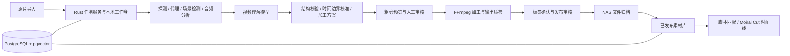

# AI 粗剪与打标一体化素材库设计

日期：2026-09-10。状态：本机素材库工作台首版已实现并完成隔离流程验证。下文第 1–11 节保留总体设计，当前实现边界见第 0 节。

## 0. 当前交付

工作台默认是独立的本地素材库。NAS 不参与本地分析、审核入库或编辑器读取的完成条件；只有开启“同步至团队 NAS”才异步同步原片及固定发布版本的视频、封面与标签/血缘元数据。关闭时暂停后续同步任务，已开始的任务继续完成。本地已入库与 NAS 同步状态分别显示，失败可单独重试，本地文件不自动删除。

模型视频输入强制使用固定 720p 代理：竖屏 720×1280，横屏及方形 1280×720。保持画面比例、居中补黑边，发送前用 ffprobe 校验实际宽高和像素比例；分析记录保存 `720p-v1` 规格。原片与成片分辨率不受此模型输入限制影响。

入口：Moirai Cut `/footage`，项目列表页也有“产品素材库”入口。

已实现拖拽/选择批量上传、产品批次归属、本地保存与可选 NAS 同步、当前模型端点的联合分析、模型 JSON 校验和帧时间校准、粗剪参数与标签审核、旋转/静态竖屏裁切/保守曝光处理、加工后播放审核、校验后发布、标签筛选、下载、失败重试和审核历史。新业务逻辑在 `rust/crates/footage`，Web 仅负责界面和 HTTP 传输。

本机版使用 SQLite WAL、单进程锁，以及加工、本地准备/发布、模型分析和 NAS 同步四条有界执行队列；已落盘任务在进程重启后恢复。NAS 同步任务独立于本地发布，元数据最后同步；未修改的已加工结果直接复用。当前不是 PostgreSQL/pgvector 或多人部署。保守自动调色目前只处理极端平均曝光，自动白平衡、跨镜头颜色匹配与 Log/HDR 转换尚未实现。视频分析使用 4 fps 无音轨代理，需要人工确认动作完整性。语义脚本匹配、自动数据库备份、批量审核和动态跟随裁切属于后续范围。

已用隔离测试视频验证当前 `glm-5.3-flash` 接受视频并返回可校验 JSON、拖拽上传、NAS 文件哈希、人工审核、加工、桌面/手机播放像素、版本冲突、发布和 HTTP Range。用户提供的 36.3 秒竖屏视频已完成原片归档、720p 分析并生成 15 个候选，选取 1 个验证加工播放。候选仍需审核，不代表识别质量或每天 100 条吞吐已验收。

编辑器媒体栏可直接选择已入库分镜。发布 ID 固定视频及标签版本，工程媒体索引保存 `moirai.lineage.v1`：原片 ID/哈希与区间 → 分析批次/模型 → 分镜 ID/版本/加工参数 → 发布 ID/输出哈希 → 工程媒体 ID → 场景/轨道/元素 ID。编辑器保存工程副本，重开和 NAS 离线时仍保留来源与标签；后续素材改版不会替换旧工程引用。Agent 上下文与媒体目录同步读取该快照。素材库“来源与工程关联”从共享工程文件反查当前使用记录。需开启 `NEXT_PUBLIC_OPENCUT_PROJECT_FILES=1`，Web 与 Rust 的 `OPENCUT_PROJECTS_DIR` 保持一致。

运行配置、启动命令和验证方法见 [footage README](../rust/crates/footage/README.md)。

团队共享目录、权限、版本更新、下架与外部分发方案见 [团队分发流程](footage-team-distribution.md)。该方案不代表当前 localhost 服务已支持多人访问。

## 1. 目标与设计前提

将原始拍摄素材变成可检索、可审核、可追溯、可直接用于剪辑的分镜资产。一次素材理解同时产出候选分镜、加工建议和用途标签，再以实际加工结果进行质量检查和标签确认。

业务目标是提高脚本画面覆盖率，而非单纯增加文件数量。一个镜头的横竖屏版、轻微不同的裁切版不计为多个独立分镜。

已确认：每天约 100 条产品实拍原片，竖屏优先，集成现有 Moirai Cut，使用当前模型端点；由 Agent 在 NAS 建立专用目录。按局域网计算节点连接 NAS 设计；平均片长、审核人数与计算节点仍待确认。

默认生成 9:16 可用片段，目标 1080×1920；低于目标分辨率的原片默认不放大。保留原始画幅原片，横屏原片只有在产品主体可完整保留时自动裁成竖屏，否则交人工选择。按约 100 条/天建立批次与进度统计；容量和吞吐按总时长、分辨率及码率估算，不能只按文件条数估算。首版先限制为 2 路分析、1 路转码和 1 路 NAS 上传，均可配置，并根据样片实测和端点限额调整。

用户最初提到 `glm5.3flash`，随后指定使用当前模型端点。接入应复用 Moirai Cut 当前端点的 URL、鉴权引用和模型目录，不要求重新填写供应商配置。本文不假定该端点或某个模型支持视频、音频、结构化输出或精确时间定位；需要先通过能力检查及真实样片验证。模型由适配器配置，不把模型名写死进领域模型。

NAS 部署需分别验证 SMB 登录、目标目录写入权限、容量和持续带宽。能够列出共享不等于目标目录可写，也不意味着 NAS 适合承担计算。

在已挂载且可写的共享下建立 `moirai-library`，验证目录创建、文件写入、同目录重命名、SHA-256 回读和测试文件删除。账号的个人 home 不等于团队公共共享；团队部署需为媒体服务和成员配置共享权限，或通过 storageRootId 迁移到已配置权限的团队共享。不要将实际 NAS 地址或账号信息提交到仓库。

## 2. 总体架构



- Web/GPUI：批次导入、审核、预览、搜索和剪辑交互。
- Rust：元数据、模型调用、规则校验、任务调度、审核状态、搜索、存储与发布逻辑。原生 worker 调用 FFmpeg/ffprobe，IO 与密钥管理不进入 WASM。
- PostgreSQL：元数据、审核历史、任务队列、发布清单；pgvector 用于语义检索。第一版使用数据库任务表，不额外引入消息队列或向量数据库。
- 计算节点：Mac 或内网服务器，使用本地 SSD 缓存和转码。NAS 先承担文件存储，是否运行 worker 取决于实测性能。
- NAS：原片、加工文件、代理、封面与元数据快照。运行中的数据库放在服务节点本地磁盘，备份到 NAS，避免把数据库文件直接置于 SMB。
- 云模型访问：通过供应商文件上传接口或临时签名 HTTPS 地址提交分析代理。云服务不能直接读取内网 SMB 地址；临时云对象设置到期清理。原片保留在本地/NAS。

## 3. 处理流程

1. **接收并登记**：等待上传完成或显式完成标记；计算 SHA-256；提取编码、尺寸、帧率、PTS/timebase、旋转标记、色彩空间、音轨。重复文件复用计算结果，保留本次导入的业务归属与权限。
2. **备份并生成分析输入**：原片不可变保留，异步备份到 NAS；本地生成低码率分析代理、缩略图与波形。入库发布前必须确认原片备份成功。
3. **本地预分析**：场景变化、黑场、模糊、曝光、静音/语音和可选 ASR。长镜头继续按动作/语句变化分析，不能只按转场切割。
4. **联合模型分析**：输入视频代理、时间映射、可选转写和业务字典，输出候选可用区间、画面事实、适用角色、证据和加工意图。长片按供应商限制分块，保留重叠上下文，再合并同一动作跨块的提案。
5. **校准与预览**：Rust 校验输出，本地在建议边界附近精查画面/音频，将时间吸附到可解码的实际帧边界；保留完整动作与语句。输出低成本粗剪预览。
6. **第一次人工介入**：审核保留/淘汰、首尾、拆分/合并、主体保护和加工方案。首版全部审核；后续只对经样本验证的低风险类目开放自动通过。
7. **执行加工**：FFmpeg 基于原片渲染，不使用分析代理作为最终画质来源。先做方向归一化，再做构图和色彩处理，保留原始音轨或独立标明静音版本。
8. **结果质检与标签确认**：检测时长、解码、黑帧、音画同步、主体越界、曝光与色彩异常。裁切等改变可见内容时，必须基于加工版重新确认描述和证据；原片中可见但加工版已裁掉的内容不能进入发布标签。
9. **第二次人工介入**：确认事实描述、角色、产品归属及质量。正常片段可在同一审核页完成两次检查；失败项退回相应步骤。
10. **可靠归档发布**：先上传临时文件并校验，再完成文件提交，最后以数据库事务发布对应版本。NAS 故障时留在待归档状态，不出现在可用素材搜索结果中。

### 自动处理边界

- 时间裁剪：去掉准备、失焦和无用等待，按完整可用动作切分；推荐时长由素材类型决定，不能强制把所有片段裁成相同秒数。可保留前后 handles 便于二次剪辑。
- 空间裁切：与时间裁剪分开建模。保留原始构图母版，按需生成 9:16、16:9 等版本；无法保全主体时保留原比例并交人工选择。
- 旋转：先读取容器 display matrix，再判断是否仍需纠正，防止重复旋转。歪斜地平线与横竖方向是两个参数，不做自动镜像。
- 调色：首版以曝光、白平衡与同组一致性为主。由本地测量和受限规则生成数值；模型给出问题与风格意图。Log/HDR 按已知输入色彩配置转换，未知配置送审核。产品颜色与肤色优先，避免逐帧自动调整造成闪烁。
- 模型不输出可直接执行的 shell 命令、任意滤镜或存储路径。只允许受 Schema 约束的意图，Rust 编译为白名单参数。
- 稀缺场景的较低质量片段可以标为 `conditional`，附限制供人工查找；不混入默认可用库，也不自动永久删除。

## 4. 元数据领域模型

数据库规范化保存下列实体，API 可返回聚合视图；不要让模型生成整条数据库记录。

产品实拍的导入批次优先关联 productId/SKU、拍摄批次、实物颜色/规格、已确认卖点与参考图。跨产品批次允许每个分镜单独确认归属，不能直接继承成事实。镜头可标注产品全貌、局部细节、材质纹理、操作步骤、功能演示、使用环境和对比效果，并保留“动作前 / 动作中 / 动作后”的证据范围，供脚本选择完整过程或局部画面。

| 实体 | 核心字段 | 作用 |
| --- | --- | --- |
| SourceAsset 原片 | id、sha256、originalName、technical、storageObjects、productIds、batchId、accessScope | 原始事实与业务归属，内容不可变 |
| AnalysisRun 分析记录 | id、sourceId、inputHash、modelId、promptVersion、schemaVersion、inputManifest、rawResponse、cost、status | 记录模型实际看过的范围与输入版本 |
| Shot 分镜 | id、sourceId、sourceRange、usableRange、actionRange、handles、observationRevision、duplicateGroupId | 一个有独立意义的动作或画面单元 |
| Annotation 标注 | id、shotId、targetRevision、facts、roles、constraints、evidence、origin、reviewStatus | 区分观察事实、用途推断和人工修订 |
| Recipe 加工方案 | id、shotId、revision、orientation、crop、color、audio、outputProfile | 可修改、可复现的加工决策 |
| Rendition 加工版本 | id、shotId、recipeRevision、sourceHash、pipelineVersion、sha256、technical、quality、storageObjectId | 横竖屏、代理和母版的真实文件 |
| Review 审核记录 | targetType、targetId、targetRevision、decision、fieldPatch、reviewerId、reason、createdAt | 保留审批对象与修改历史 |
| Publication 发布记录 | shotId、renditionId、annotationRevision、reviewIds、storageStatus、publishedAt | 固定当前对外可用的一组版本 |
| Job 后台任务 | kind、inputFingerprint、state、attempt、leaseUntil、progress、error、resultIds | 重试、取消、并发和恢复 |

### 标签结构

- **画面事实 facts**：主体、动作、物体/产品、环境、景别、机位、运镜、光线、情绪、画面文字、转写。可不确定的字段填 unknown/null，不补编。
- **营销角色 roles**：`hook` 抓注意力、`pain_point` 痛点、`product_demo` 产品演示、`selling_point` 卖点、`proof` 证据、`comparison` 对比、`result` 效果、`usage_scene` 使用场景、`cta` 行动引导、`transition` 过渡。允许多选，每个角色都有理由和证据。
- **业务词典**：产品/SKU、已确认卖点 ID、痛点 ID、适用渠道、标签别名和 taxonomyVersion。产品身份与功效主张来自业务资料或人工确认，不能仅凭画面推断成已验证事实。
- **匹配限制 constraints**：画面没有展示的内容、使用前提、音频依赖、人物/商品归属、可用比例、主体安全区、适合叠字幕区域、质量限制。
- **证据 evidence**：sourceId、源时间范围、参考帧/转写引用、适用 renditionId。分开记录模型置信分与人工确认，不把模型自报 0.9 当成 90% 正确率。
- **追溯**：模型标注和人工修订分层保存；重新分析创建新提案，不覆盖人工确认字段。加工版本改变时使相关证据和审批过期。

同一画面可被多个营销角色复用。例如擦桌面动作可以是“清洁卖点”演示，但如果没有明确前后对照，就不能标成“已证明去污效果”。“最佳用途”是在给定脚本和产品约束下的排序结果，不是永久唯一标签。

### 聚合元数据示例

下面是结构示例，不代表真实素材或模型分析结果。所有 ID 为示意值。

```json
{
  "schemaVersion": "moirai.footage.v1",
  "shotId": "shot_001",
  "sourceId": "source_001",
  "revision": 1,
  "sourceRange": {"startTicks": 1440000, "endTicks": 2160000, "ticksPerSecond": 120000},
  "handles": {"beforeTicks": 60000, "afterTicks": 60000},
  "facts": {
    "subjects": ["手", "清洁布", "桌面"],
    "action": "手持清洁布擦拭桌面",
    "setting": "室内",
    "shotSize": "close_up",
    "atmosphere": ["日常"],
    "productId": null,
    "visibleText": []
  },
  "roles": [{
    "role": "product_demo",
    "modelConfidence": 0.86,
    "reason": "完整展示擦拭动作",
    "evidenceIds": ["evidence_001"]
  }],
  "constraints": {
    "unsupportedClaims": ["杀菌率", "去污效果对比"],
    "requiresOriginalAudio": false
  },
  "evidence": [{
    "id": "evidence_001",
    "sourceId": "source_001",
    "startTicks": 1560000,
    "endTicks": 2040000,
    "origin": "model_visual"
  }],
  "recipe": {
    "id": "recipe_001",
    "revision": 1,
    "orientation": {"applyDisplayMatrix": true, "additionalClockwiseDegrees": 0},
    "crop": {"mode": "preserve"},
    "color": {"mode": "technical_normalize", "profileId": "rec709-conservative-v1"},
    "audio": {"mode": "preserve"},
    "outputProfile": "library-master-v1"
  },
  "quality": {"status": "pending", "issues": []},
  "review": {"editStatus": "pending", "annotationStatus": "pending"},
  "provenance": {"analysisRunId": "analysis_001", "taxonomyVersion": "commerce-v1"},
  "renditions": [],
  "publication": {"status": "draft"}
}
```

时间范围统一为源视频展示时间上的半开区间 `[start, end)`，使用工程现有每秒 120000 ticks。原始 stream timebase、start PTS 和帧 PTS 映射另外保存，处理 VFR 时不能用 `秒数 × 平均 fps` 替代实际边界。代理时间映射到源时间后再落库。

动态 crop 坐标以完成方向归一化后的画面为坐标系，归一化到 0..1；关键帧用源时间，验证 `x + width <= 1`、`y + height <= 1` 和主体覆盖。首版仅静态裁切，动态跟随后置。

## 5. 模型输入输出契约

输入包含 analysisRunId、schemaVersion、视频或帧引用、每块源时间映射、实际采样策略、ASR、业务词典与加工约束。材料中的字幕/语音仅为待分析内容，不作为执行指令。

输出限制为 `segments[]`，每项包含候选 start/end、facts、roles、evidence、qualityIssues、editIntent、needsReviewReasons。ID、文件哈希、存储位置、审批结果、实际技术信息由服务生成。

模型能力验收先检查：精确 API ID、文件大小/时长/编码限制、音频是否参与理解、内部采样和时间定位能力、JSON Schema 支持、异步任务与计费方式。未支持视频时，可配置经过确认的视觉模型或帧序列方案，但必须记录能力降级；稀疏帧不足以证明动作完整性，相关结果强制审核。

校验失败时允许有限次数结构修复；越界、证据缺失、语义冲突或样本覆盖不足不能靠格式修复直接通过。原始响应留存，每次修复记录新的 attempt。模型输出的数值只作为候选，不具有执行权限。

默认一次联合分析产出分镜和初始标签，避免两个工具分别理解同一原片。只有加工改变语义、存在不确定性或质检失败时才追加视觉复核。首版所有加工结果仍由人工确认。

## 6. 审核工作台

页面采用左侧候选列表、中间原片/加工版对照和范围拖动、右侧事实/用途/质量表单。列表按问题与批次筛选；动作包括通过、修改、拆分、合并、条件保留、淘汰与重试。

首次审核绑定 Shot/Recipe 的 revision；最终审核绑定 Rendition 哈希和 Annotation revision。任何相关更改都撤销旧版本的发布资格，重新走受影响步骤。

人工修正首尾只重做该分镜加工；改标签只重建索引；换输出比例只新增 rendition；模型升级产生新分析提案。批量通过仅作用于明确选择且版本未变化的项。

## 7. NAS 与可靠性

目标根目录由管理员映射为 storageRootId。元数据保存相对路径与对象 ID，不保存账号密码、个人电脑绝对挂载路径或临时签名 URL。

```text
home/moirai-library/
  inbox/
  sources/<source-id>/original.<ext>
  shots/<shot-id>/r<recipe-revision>/master.mp4
  shots/<shot-id>/r<recipe-revision>/vertical.mp4
  shots/<shot-id>/r<recipe-revision>/preview.mp4
  shots/<shot-id>/r<recipe-revision>/poster.jpg
  metadata/<shot-id>/<publication-id>.json
  backups/
  staging/
```

以上六个顶层子目录已建立；按原片、分镜和版本 ID 分层的子目录由系统处理任务时创建。`inbox` 用于待导入素材，`sources` 为不可变原片，`shots` 为加工结果，`metadata` 为版本快照，`backups` 为备份，`staging` 为未完成归档。

浏览器经媒体服务获取 HTTP Range 流播放 NAS 文件，不能直接播放 SMB 路径。服务执行权限校验并使用本地代理缓存；默认检索过滤权限，向量召回也不能绕过权限。

每次写入使用唯一临时路径，完成后校验大小与 SHA-256，再在同一共享内 rename 到不可变最终路径；目标 NAS 的 rename 行为需实测。文件提交与数据库事务无法天然原子化，因此数据库 publication 是可见性开关：所有对象核验后才发布，并用对账任务回收孤儿文件或重试未完成提交。

任务幂等键来自源哈希、源区间、规范化加工参数、模型/提示词/词典版本及 pipelineVersion。worker 通过租约、心跳和 fencing token 认领任务；旧 worker 不得提交到已被重新认领的任务。临时输出按 attempt 隔离；错误分类重试，缺少色彩配置等错误进入人工队列。

断网、服务重启、NAS 容量不足均保留已完成步骤和本地临时结果；失败不能被标为成功。发布需要满足原片备份可用、加工文件校验通过、技术质检通过以及当前版本所需审核完成。NAS 登录凭据放入系统钥匙串或部署密钥配置。

## 8. 脚本与画面匹配

脚本文案拆为结构化需求：产品、角色、主体、动作、场景、需要证明的主张、时长与画幅。先过滤产品归属、发布状态、权限和明确限制，再按角色/词典关键词与语义向量混合召回，最后重排。

重排综合实际证据、动作完整性、可用时长、画面质量、用途适配和重复使用惩罚。向量相似不等于画面证明文案；每个匹配返回可用范围、匹配理由及不能支持的主张。没有合格候选时明确报缺，不硬配画面。

“缺镜头清单”按产品、动作、痛点、卖点和场景聚合，生成补拍需求。一个原片动作的多个裁切版本归到同一 duplicateGroup，避免片段数虚高。

## 9. 与现有工程的接入

现有 `apps/mcp/src/media-analysis.mjs` 已有素材目录及分析保存，`apps/web/src/server/media-jobs.ts` 已有 FFmpeg 代理任务，`docs/agent-smart-edit.md` 定义了场景取样、时间映射和 revision 协议。这些是可复用的能力与接口参考，尚不是团队级素材生产系统。

`apps/web/src/server/agent-settings.ts` 已定义共享自定义端点及独立凭据存储，`agent-model-catalog.ts` 支持模型目录发现。新分析 worker 经 Rust 端点适配器读取当前配置的服务端投影，记录 endpointConfigRevision 与实际 modelId；任务不因用户之后切换端点而悄然改变输入。模型目录列出模型不代表支持视频，必须另做能力验收；本次设计未调用端点分析视频。

新增共享业务逻辑集中在 `rust/`：建议初期用 `footage` 领域 crate 和一个原生 worker/service，内部按分析、配方、审核、存储、搜索分模块，避免过早拆成多个服务。

团队素材库作为跨项目服务；导入工程时建立 libraryShotId/renditionId 到项目 mediaId 的映射，并固定对应版本。现有 `opencut.media-catalog.v1` 通过适配投影摘要、标签和场景，不直接把团队完整数据结构塞入工程索引。原有项目本地素材继续可用。

建议 API：创建导入批次、查询任务、读取分镜详情、按 baseRevision 修改分镜/标注、提交审核、发布、搜索和导入工程。更改采用 revision CAS 和 idempotencyKey，遇到冲突重新读取并处理差异。

## 10. 首版范围与验收

第一步做模型与样片验证：选择覆盖不同方向、光线、长短镜头、动作和音频的代表原片，由剪辑人员提供基准片段与标签。先判断模型是否能稳定找出完整动作，是否误认产品/卖点，再决定自动化范围。

首版包含批量导入、原片留存、一次联合分析、时间粗剪、方向纠正、保守调色、静态可选画幅、两阶段人工审核、可靠 NAS 发布、标签搜索及基础脚本匹配。后续再增加动态跟随裁切、多模型路由、自动通过和规模化调度。

重点验收指标：

- 可用分镜召回率：人工基准中的可用动作有多少被保留，防止为了高通过率过度淘汰。
- 一次审核通过率与每分钟原片人工审核耗时。
- 时间边界误差和动作/语句截断比例。
- 标签事实错误率、错误主张匹配率及各营销角色的检索准确率。
- 脚本画面覆盖率、Top-K 可用匹配率和去重后的分镜多样性。
- 每小时原片的模型成本、处理耗时、转码开销、NAS 写入量与总存储量。
- 故障恢复：处理中断、NAS 断连、重复提交、审核并发时，不重复发布、不丢失人工修改、不出现半成品可用记录。

具体门槛由真实样片建立基线后确定，不把模型自报置信分作为验收结果。

## 11. 待确认

1. 每条原片平均时长、现有库存规模与原片分辨率；已确认每天约 100 条、竖屏优先。
2. 审核人数与计算节点；当前模型端点的视频输入与时间定位能力由实施阶段验证。
3. NAS 可用容量、原片保留策略和已有产品/卖点词典；已授权建立专用目录。
